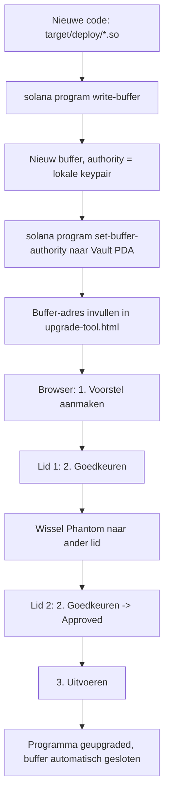

# Arcium Confidential Darkpool Suite — Handleiding

**Dark Matter Labs** | v0.2.0 | Solana Devnet

---

## Wat is dit?

Vier versleutelde darkpools op Solana. Invoer wordt versleuteld voordat het de keten raakt. Arcium MPC-nodes berekenen het resultaat zonder de echte waarden te zien.

---

## Deel 1: Live demo

**URL:** https://anoadder-ship-it.github.io/darkpool-demo-

1. Installeer Phantom wallet: https://phantom.app
2. Stel Phantom in op Devnet: tandwiel > Developer Settings > Network > Devnet
3. Haal gratis SOL op: https://faucet.solana.com
4. Open de demo, connect Phantom, klik Encrypt & match

---

## Deel 2: SDK installeren

```bash
npm install arcium-darkpool-sdk
```

### Trading

```typescript
import { DarkpoolClient } from "arcium-darkpool-sdk";
const client = await DarkpoolClient.create({ programId: "h6zsnHt28...", heliusApiKey: "...", cluster: "devnet" }, keypair, idl);
const result = await client.matchOrders({ buyBid: 100n, sellBid: 95n });
console.log(result.matched); // true
```

### Medical

```typescript
const result = await client.matchDataset({
  diseaseCode: 340n, sampleCount: 5000n, ageMean: 580n, genderFemale: 40n, dataModality: 2n,
  queryDisease: 340n, minSamples: 1000n, ageMin: 500n, ageMax: 700n, queryModality: 2n,
});
console.log(result.compatible, result.score.toString()); // true, "100"
```

### Supply chain

```typescript
const result = await client.matchSupply({
  materialCode: 1001n, quantity: 50000n, qualityGrade: 85n, pricePerUnit: 150n, deliveryDays: 7n, supplyRegion: 1n,
  reqMaterial: 1001n, minQuantity: 10000n, minQuality: 80n, maxPrice: 200n, maxDelivery: 10n, reqRegion: 1n,
});
console.log(result.matched, result.score.toString()); // true, "96"
```

### Chip marketplace

```typescript
import { ChipType, ChipCondition, Region, CertLevel } from "arcium-darkpool-sdk";
const result = await client.matchChip({
  chipType: BigInt(ChipType.H100), quantity: 10n, condition: BigInt(ChipCondition.New),
  pricePerUnit: 3500000n, deliveryDays: 14n, listRegion: BigInt(Region.EU), certLevel: BigInt(CertLevel.Datacenter),
  reqChipType: BigInt(ChipType.H100), minQuantity: 5n, maxCondition: BigInt(ChipCondition.Used),
  maxPrice: 4000000n, maxDelivery: 30n, reqRegion: BigInt(Region.EU), minCert: BigInt(CertLevel.Datacenter),
});
console.log(result.matched, result.score.toString()); // true, "98"
```

---

## Deel 3: Eigen darkpool bouwen

```bash
git clone https://github.com/anoadder-ship-it/darkpool-template
./darkpool-template/new-darkpool.sh mijnpool
```

1. Bewerk encrypted-ixs/src/lib.rs (circuit logica)
2. FEXBash -c "arcium build --skip-keys-sync"
3. solana program deploy target/deploy/mijnpool.so
4. ts-node scripts/init-mxe.ts
5. node scripts/test-mijnpool.js

---

## Deel 4: Codes en enums

### Chiptypen
- 1001=H100, 1002=H200, 1003=GB200, 1004=A100, 1005=L40S
- 2001=MI300X, 2002=MI250
- 3001=Gaudi3, 3002=Gaudi2
- 9001=GPU, 9002=CPU, 9003=ASIC, 9004=FPGA

### Conditie: 1=Nieuw, 2=Refurbished, 3=Gebruikt

### Regio: 1=EU, 2=VS, 3=Azie, 4=Globaal

### Certificaat: 1=Datacenter, 2=Workstation, 3=Consumer

### Materiaal: 1001=Staal, 1002=Aluminium, 1003=Koper, 2001=Chips

### Datamodaliteit: 1=Genomisch, 2=Beeldvorming, 3=Lab, 4=Klinisch

---

## Deel 5: Bekende bugs en oplossingen

### declare_id! overschreven
Altijd bouwen met: arcium build --skip-keys-sync

### anchor.workspace verkeerd program ID
```typescript
IDL.address = PROGRAM_ID.toBase58(); // voor new anchor.Program(IDL, provider)
```

### MXE init SizeMismatch
CLI bug — gebruik TypeScript SDK initMxePart1 + initMxePart2. Zie scripts/init-mxe.ts

### ts-node OOM
Gebruik: NODE_OPTIONS="--max-old-space-size=8192" yarn ts-node
Of compileer eerst met tsc en draai als plain node

---

## Deel 6: Program IDs (devnet)

- Trading:      h6zsnHt28NpeS94Ek3fQP1YEiu1WrpGT2pKynWZzKVX
- Medical:      CZQBaJFJnGA2pyEnrfxCmsUewcHJLDGHgzrcVjomzDD4
- Supply chain: 3HQHpSBSgYkx81E25bSJZVz4mGoW6nQFJWDtZL9fmMR4
- Chip:         6xLjbo4yfc5j2CMu69DkycTJrGZttHzeqieXf2NPvu8o
- Cluster offset: 456

**Multisig-beheer (Squads V2, 2-of-3):**
- Multisig PDA: J6dar1yhhx8NPVYbRRF2EJXRnS7eD7J4NT6X2ohGfs1b
- Vault PDA (index 0), upgrade authority van alle vier programma's: EmYvQBX7WPmLDnYEhSGRPv9wWf9whAEgLnZviSc4xWqY
- Leden: HnQPCEiCTT8fzvPpRpz5J3fxsL3vELRVuaqfVFM154Ly, DDzVGAfzrFCu5QEFstv2KNHsxRTgQVAC6nSqp1PWh46d, 4sRKi6mErV1fJCXNyY1RevU7Gv29gFJw82frweK86bmx

---

## Deel 7: Multisig Upgrade Procedure

Alle vier darkpool-programma's staan onder een Squads V2 2-of-3 multisig.
Geen enkele upgrade kan door een persoon alleen worden uitgevoerd — er zijn
altijd 2 van de 3 leden nodig. Volledige, geverifieerde procedure hieronder
(bewezen op alle vier programma's, 15 juli 2026).

**Tool:** `~/upgrade-tool/upgrade-tool.html`, draaiend via
`python3 -m http.server 8898` op `http://localhost:8898/upgrade-tool.html`.



**Stappen:**

1. `solana program write-buffer target/deploy/<naam>.so --url https://api.devnet.solana.com`
   → geeft nieuw buffer-adres
2. `solana program set-buffer-authority <BUFFER> --new-buffer-authority EmYvQBX7WPmLDnYEhSGRPv9wWf9whAEgLnZviSc4xWqY --url https://api.devnet.solana.com`
3. Buffer-adres invullen in de dropdown van `upgrade-tool.html` (bewerk de
   `<option value="PROGRAM_ID|BUFFER_ADRES">`-regel; maak eerst een backup)
4. Browser: Connect Phantom (lid 1) → **1. Voorstel aanmaken**
5. **2. Goedkeuren (huidig account)** — 1e goedkeuring
6. Wissel Phantom naar een ander lid → Connect Phantom opnieuw →
   **2. Goedkeuren (huidig account)** — 2e goedkeuring
7. **3. Uitvoeren**

**Bekende foutcodes:**

| Fout | Betekenis | Oplossing |
|---|---|---|
| `Custom:6008` bij Uitvoeren | `InvalidProposalStatus` — nog niet 2/2 goedkeuringen | Tweede, ander lid laten goedkeuren |
| `Custom:6008` bij Goedkeuren | Verkeerde knop ingedrukt (was eigenlijk Uitvoeren) | Controleer welke instructie de browserconsole logt |
| `IncorrectProgramId` | Buffer-adres bestaat niet (meer) op devnet | Nieuw buffer aanmaken (stap 1-2), verifiëren met `getAccountInfo` |

Diagnostische scripts (voorstelstatus checken, transactielogs uitlezen,
buffer verifiëren) staan in `UPGRADE-PROCEDURE.md` in de root van
`solana_darkpool` op de DGX Spark.

---

## Deel 8: Links

- Demo: https://anoadder-ship-it.github.io/darkpool-demo-
- npm: https://www.npmjs.com/package/arcium-darkpool-sdk
- Template: https://github.com/anoadder-ship-it/darkpool-template
- Blogpost: https://paragraph.com/@darkpool
- Arcium docs: https://docs.arcium.com
- Faucet: https://faucet.solana.com

---

*Dark Matter Labs — anoadder@gmail.com*
